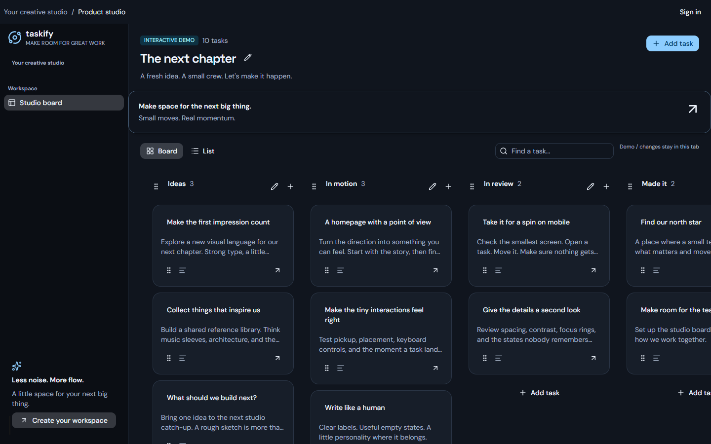
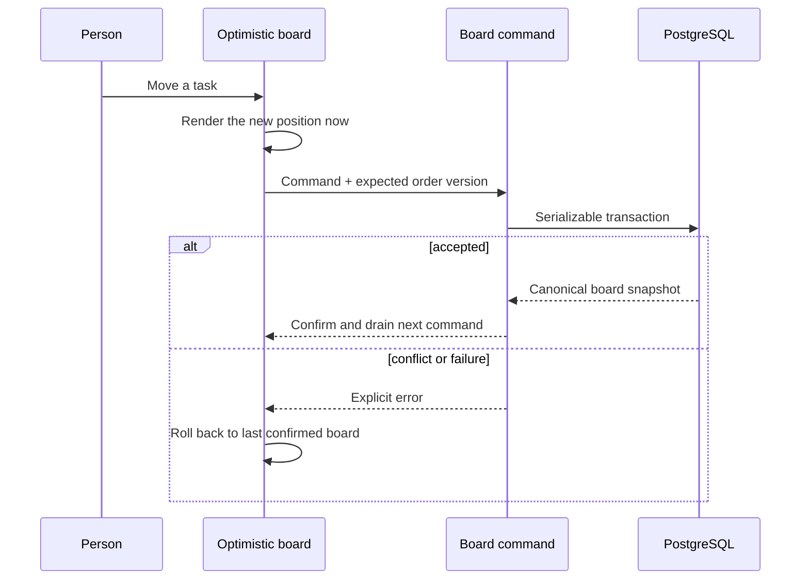
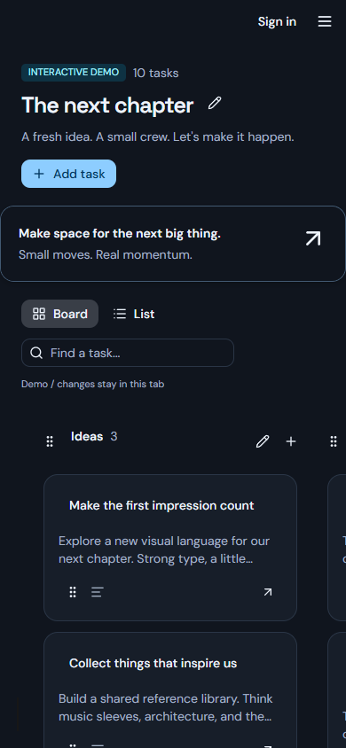
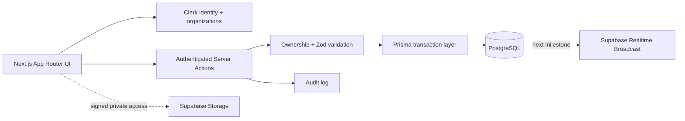

<div align="center">


# TASKIFY

### Big ideas. Clear next moves.

An expressive, dark-first workspace where small teams can turn rough ideas into visible momentum.

[Explore the product](#the-product) &nbsp;&middot;&nbsp; [Run the demo](#run-it-locally) &nbsp;&middot;&nbsp; [Understand the system](#how-it-holds-together) &nbsp;&middot;&nbsp; [See what comes next](#the-next-move)


</div>

---

> Taskify is designed around one feeling: the team should always know what matters, what is moving, and what to do next.

## The Product



Taskify is a working project workspace built around a fast Kanban core. The current milestone replaces the original interface with a custom Astryx design system, a resilient board engine, and a public interactive demo that can be explored without an account or database writes.

| Move | What it feels like |
| --- | --- |
| **Capture** | Add a task without leaving the board or breaking focus. |
| **Shape** | Open a focused task panel, clarify the outcome, and choose its lane. |
| **Move** | Drag cards and lists with immediate feedback and explicit save state. |
| **Find** | Search the board and switch between spatial Board and focused List views. |
| **Recover** | Roll back failed optimistic changes and refresh safely after reconnecting. |

<details>
<summary><strong>What works today</strong></summary>

- Authenticated Clerk organizations and workspace navigation
- Boards, lists, tasks, descriptions, ordering, deletion, and audit history
- Cross-list and list-level drag with optimistic queues and rollback
- Order-version conflict detection and serializable database transactions
- Board and List modes, search, URL-backed task deep links, and responsive mobile navigation
- Stripe subscription entry points and organization billing/settings surfaces
- A local-only `/demo` experience with realistic data and zero persistence
- A custom dark Astryx theme with reduced-motion support and semantic design tokens

</details>

<details>
<summary><strong>What is intentionally next</strong></summary>

- Assignees, due dates, labels, comments, and attachment metadata
- Private Supabase Storage uploads with signed access
- Private Supabase Realtime channels for board invalidation and presence
- Multi-client conflict tests, authorization adversarial tests, and performance traces

</details>

## Built To Move

The board does not pretend a request succeeded. Every mutation travels through one authenticated command boundary, checks workspace ownership, validates the expected ordering version, and returns a canonical board snapshot.



That gives Taskify the speed of a local interaction with the honesty of a server-confirmed state.

## Two Views, One Context

The same project can be scanned spatially or read sequentially. Search state and open-task state live in the URL, so a teammate can share the exact context instead of describing where to click.

<div align="center">
  
</div>

## How It Holds Together



| Layer | Choice | Why |
| --- | --- | --- |
| Product shell | Next.js 16 App Router + React 19 | Server rendering, colocated routes, and server-side mutation boundaries |
| Visual language | Astryx 0.6.2 + custom Nocturne theme | Dense product UI with one deliberate token system |
| Identity | Clerk organizations | Existing team, invitation, and workspace model |
| Data | Prisma 5 + PostgreSQL | Typed relations and transactional ordering |
| Motion | `@hello-pangea/dnd` | Accessible drag primitives with clear handles |
| Billing | Stripe | Existing subscription and billing portal flow |
| Collaboration path | Supabase Realtime + Storage | Private live invalidation, presence, and attachments |

## Run It Locally

### 1. Prerequisites

- Node.js `>=24 <27`
- npm
- PostgreSQL
- Clerk application credentials

### 2. Install

```bash
git clone https://github.com/pankajverma2108/next-Taskify.git
cd next-Taskify
npm install
```

### 3. Configure

Copy `.env.example` to `.env` and fill the values you use:

| Variable | Required for |
| --- | --- |
| `DATABASE_URL` | Prisma and PostgreSQL |
| `NEXT_PUBLIC_CLERK_PUBLISHABLE_KEY` | Clerk browser integration |
| `CLERK_SECRET_KEY` | Clerk server authorization |
| `STRIPE_API_KEY` | Subscription checkout and portal |
| `STRIPE_WEBHOOK_SECRET` | Stripe webhook verification |
| `NEXT_PUBLIC_UNSPLASH_ACCESS_KEY` | Optional board-cover discovery |
| `NEXT_PUBLIC_SUPABASE_URL` | Planned Realtime and Storage client |
| `NEXT_PUBLIC_SUPABASE_PUBLISHABLE_KEY` | Planned public Supabase client access |
| `SUPABASE_SECRET_KEY` | Future server-only signed storage operations |
| `NEXT_PUBLIC_APP_URL` | Redirect and application URLs |

Never commit `.env` files or service-role credentials.

### 4. Prepare and start

```bash
npx prisma generate
npx prisma migrate dev
npm run dev
```

Open `http://localhost:3000/demo` for the zero-write interactive board, or create an account to use a database-backed workspace.

## Useful Commands

```bash
npm run dev          # development server
npm run lint         # ESLint
npm run typecheck    # TypeScript without emitting files
npm run build        # optimized production build
npm run theme:build  # compile the custom Astryx theme
```

## Project Map

```text
app/                    routes, layouts, marketing, demo, workspace surfaces
actions/                authenticated server actions and board command boundary
components/board/       board, list, task editor, and demo adapters
lib/board-model.ts      serializable board contract and pure move logic
lib/board-data.ts       authorized Prisma board reader
theme/nocturne.ts       source of truth for the Taskify visual system
prisma/                 PostgreSQL schema and migrations
public/readme/          verified product captures used by this README
```

## Quality Bar

The current milestone passes:

- ESLint
- TypeScript type checking
- Next.js production build
- Production dependency audit with zero known vulnerabilities
- Desktop and mobile browser inspection
- Search, view switching, task create/edit, and cross-list pointer drag flows

## The Next Move

The next build slice adds the collaboration layer without replacing the working core:

1. Extend the Prisma model with task metadata and organization-safe membership relations.
2. Connect Clerk session tokens to Supabase Third-Party Auth.
3. Add private per-board Realtime Broadcast channels for invalidation and presence.
4. Add a private attachment bucket with signed upload/download access.
5. Prove the system with two-browser conflict, reconnect, RLS, and storage-policy tests.

---

<div align="center">

**Less noise. More flow.**

Built for teams with more ideas than ceremony.

</div>
