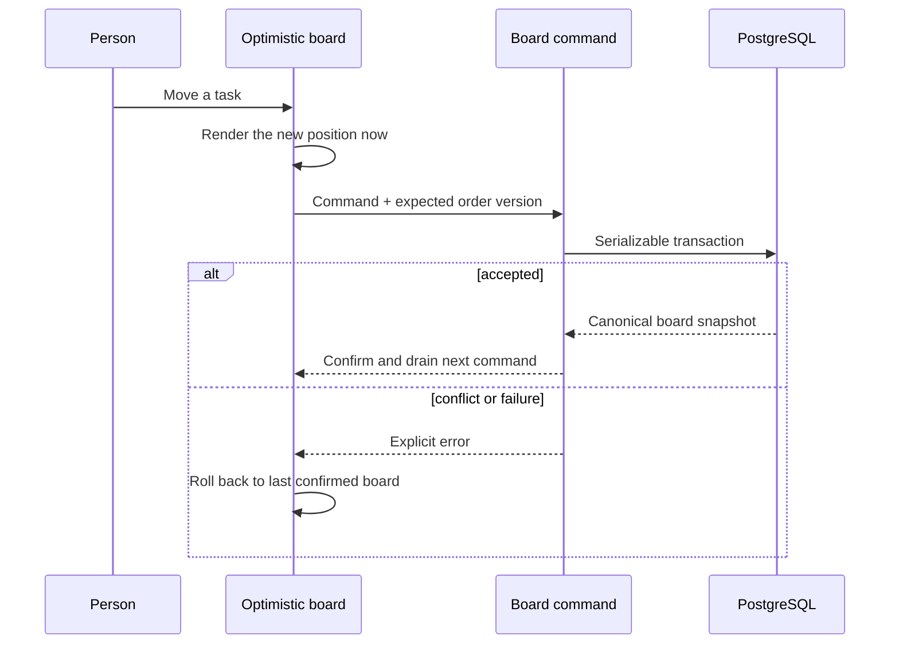
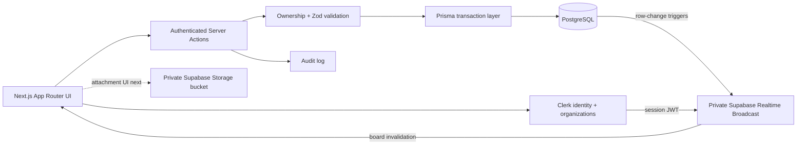

<div align="center">


# TASKIFY

### Big ideas. Clear next moves.

An expressive, dark-first workspace where small teams can turn rough ideas into visible momentum.

[Explore the product](#the-product) &nbsp;&middot;&nbsp; [Run the demo](#run-it-locally) &nbsp;&middot;&nbsp; [Understand the system](#how-it-holds-together) &nbsp;&middot;&nbsp; [See what comes next](#the-next-move)


</div>

---

> Taskify is designed around one feeling: the team should always know what matters, what is moving, and what to do next.

## The Product


Taskify is a working project workspace built around a fast Kanban core. Its current interface is powered by a local Taskify NeoPOP compatibility layer, a resilient board engine, and a public interactive demo that can be explored without an account or database writes.

| Move | What it feels like |
| --- | --- |
| **Capture** | Add a task without leaving the board or breaking focus. |
| **Shape** | Open a focused task panel, clarify the outcome, and choose its lane. |
| **Move** | Drag cards and lists with immediate feedback and explicit save state. |
| **Find** | Search the board and switch between spatial Board and focused List views. |
| **Recover** | Roll back failed optimistic changes and refresh safely after reconnecting. |

<details>
<summary><strong>What works today</strong></summary>

- Authenticated Clerk organizations and workspace navigation
- Boards, lists, tasks, descriptions, ordering, deletion, and audit history
- Cross-list and list-level drag with optimistic queues and rollback
- Order-version conflict detection and serializable database transactions
- Clerk-authenticated private Supabase Realtime invalidation with reconnect reconciliation
- Board and List modes, search, URL-backed task deep links, and responsive mobile navigation
- Stripe subscription entry points and organization billing/settings surfaces
- A local-only `/demo` experience with realistic data and zero persistence
- A custom dark Taskify NeoPOP system with sharp geometry, semantic state colors, and reduced-motion support

</details>

<details>
<summary><strong>What is intentionally next</strong></summary>

- Assignees, due dates, labels, and comments remain deferred
- Attachment UI with private Supabase Storage upload, download, and delete flows
- Board/task Presence (cursors are intentionally deferred)
- Dedicated two-browser conflict, reconnect, RLS, and storage-authorization proof

</details>

## Built To Move

The board does not pretend a request succeeded. Every mutation travels through one authenticated command boundary, checks workspace ownership, validates the expected ordering version, and returns a canonical board snapshot.



That gives Taskify the speed of a local interaction with the honesty of a server-confirmed state.

## Two Views, One Context

The same project can be scanned spatially or read sequentially. Search state and open-task state live in the URL, so a teammate can share the exact context instead of describing where to click.

<div align="center">
  
</div>

## How It Holds Together



| Layer | Choice | Why |
| --- | --- | --- |
| Product shell | Next.js 16 App Router + React 19 | Server rendering, colocated routes, and server-side mutation boundaries |
| Visual language | Taskify NeoPOP compatibility layer | CRED NeoPOP geometry adapted locally for React 19, Next.js 16, and Taskify semantics |
| Identity | Clerk organizations | Existing team, invitation, and workspace model |
| Data | Prisma 5 + PostgreSQL | Typed relations and transactional ordering |
| Motion | `@hello-pangea/dnd` + CSS motion tokens | Accessible drag primitives, 120 ms press feedback, and reduced-motion support |
| Billing | Stripe | Existing subscription and billing portal flow |
| Collaboration | Supabase Realtime + Storage | Private live invalidation now; Presence and attachment UI next |

The local NeoPOP layer is adapted from CRED's Apache-2.0 `@cred/neopop-web` source at pinned commit `1f4b3d2`. Taskify keeps its own brand, copy, information architecture, and geometric compositions. Gilroy and Cirka are the target typography roles; until licensed local font files are supplied, the runtime uses DM Sans, Space Grotesk, and Cormorant Garamond fallbacks. Exact font parity is intentionally not claimed yet.

## Run It Locally

### 1. Prerequisites

- Node.js `>=24 <27`
- npm
- PostgreSQL
- Clerk application credentials
- Supabase project URL and publishable key

### 2. Install

```bash
git clone https://github.com/pankajverma2108/next-Taskify.git
cd next-Taskify
npm install
```

### 3. Configure

Copy `.env.example` to `.env` and fill the values you use:

| Variable | Required for |
| --- | --- |
| `DATABASE_URL` | Prisma and PostgreSQL |
| `NEXT_PUBLIC_CLERK_PUBLISHABLE_KEY` | Clerk browser integration |
| `CLERK_SECRET_KEY` | Clerk server authorization |
| `STRIPE_API_KEY` | Subscription checkout and portal |
| `STRIPE_WEBHOOK_SECRET` | Stripe webhook verification |
| `NEXT_PUBLIC_UNSPLASH_ACCESS_KEY` | Optional board-cover discovery |
| `NEXT_PUBLIC_SUPABASE_URL` | Realtime and Storage client |
| `NEXT_PUBLIC_SUPABASE_PUBLISHABLE_KEY` | Browser-safe Supabase project access |
| `SUPABASE_PROJECT_REF` | Optional Supabase CLI project linkage |
| `NEXT_PUBLIC_APP_URL` | Redirect and application URLs |

Never commit `.env` files or service-role credentials.

### 4. Prepare and start

```bash
npx prisma generate
npx prisma migrate dev
npm run dev
```

Open `http://localhost:3000/demo` for the zero-write interactive board, or create an account to use a database-backed workspace.

## Useful Commands

```bash
npm run dev          # development server
npm run lint         # ESLint
npm run typecheck    # TypeScript without emitting files
npm run build        # optimized production build
npm run db:seed      # seed a local database when needed
npx supabase db push --dry-run --linked  # preview pending cloud migrations
```

## Project Map

```text
app/                    routes, layouts, marketing, demo, workspace surfaces
actions/                authenticated server actions and board command boundary
components/board/       board, list, task editor, and demo adapters
components/neopop/      Taskify-owned NeoPOP primitives, tokens, and SSR style registry
hooks/                  client collaboration and product hooks
lib/board-model.ts      serializable board contract and pure move logic
lib/board-data.ts       authorized Prisma board reader
lib/supabase/           Clerk-token Supabase browser client
.21st/                  local design context for UI work
THIRD_PARTY_NOTICES.md  NeoPOP source attribution and license note
prisma/                 PostgreSQL schema and migrations
supabase/               private Realtime, Storage, and RLS configuration
public/readme/          verified product captures used by this README
```

## Quality Bar

The current milestone passes:

- ESLint
- TypeScript type checking
- Next.js production build
- Supabase database lint and linked migration parity
- Production dependency audit with zero known vulnerabilities
- Desktop and mobile browser inspection
- Search, view switching, task create/edit, and cross-list pointer drag flows

## The Next Move

The collaboration foundation is live. The remaining product slice expands what teammates can coordinate:

1. Add attachment metadata and resumable private upload, download, and delete UI on the provisioned bucket.
2. Add board/task Presence to private channels; teammate cursors remain intentionally deferred.
3. Prove two-user/outsider two-browser Broadcast, conflict, reconnect, RLS, and storage-policy behavior end to end.
4. Add accessibility automation, performance budgets, and hosted-environment verification.

Assignees, due dates, labels, and comments remain intentionally deferred until this collaboration slice is proven.

---

<div align="center">

**Less noise. More flow.**

Built for teams with more ideas than ceremony.

</div>
